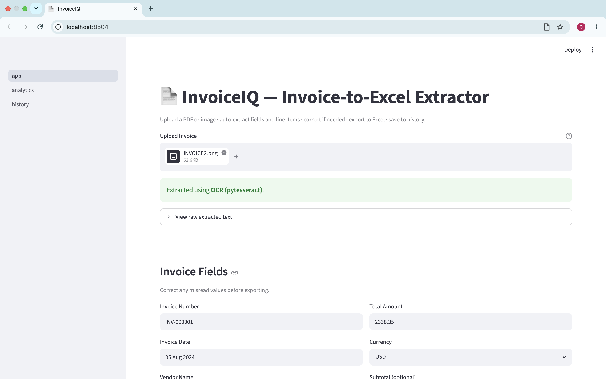
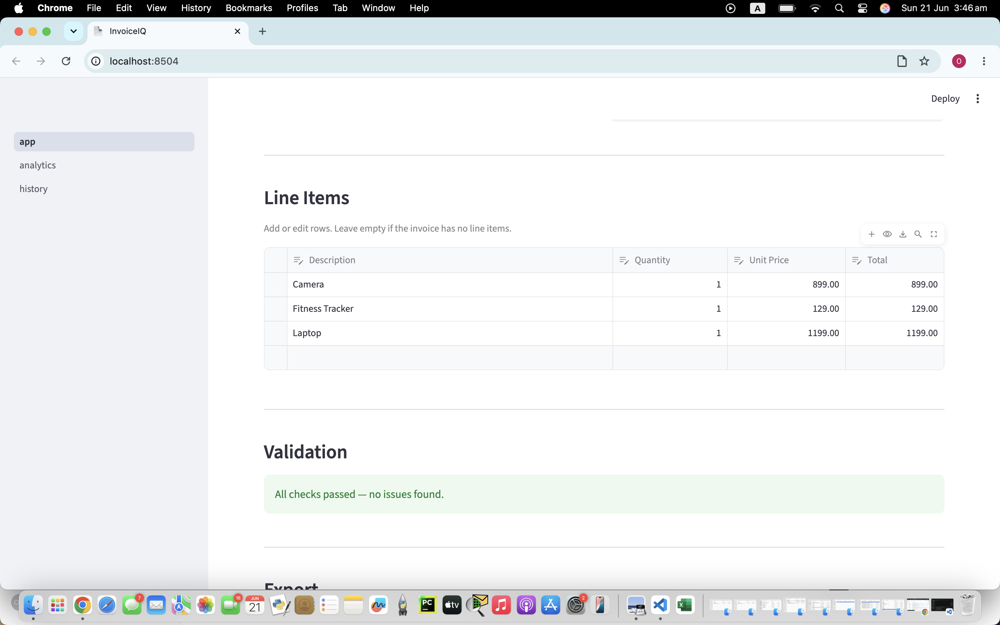
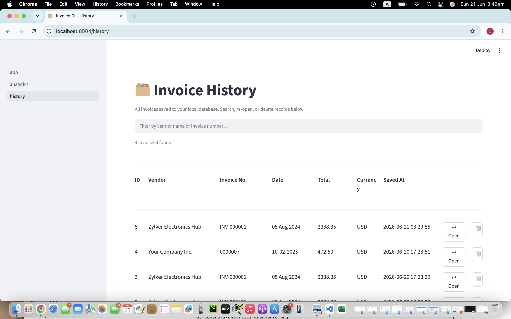
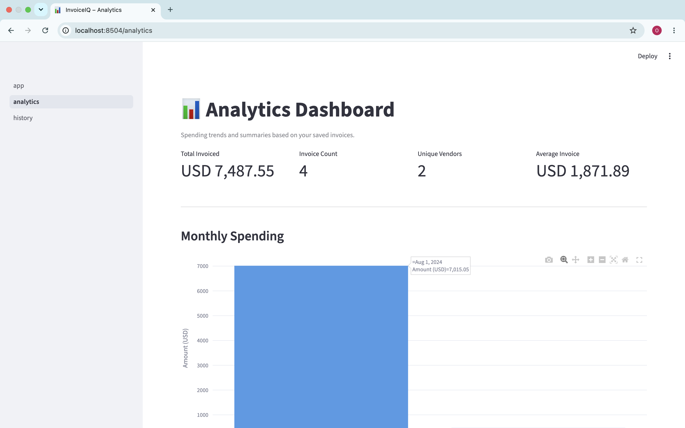
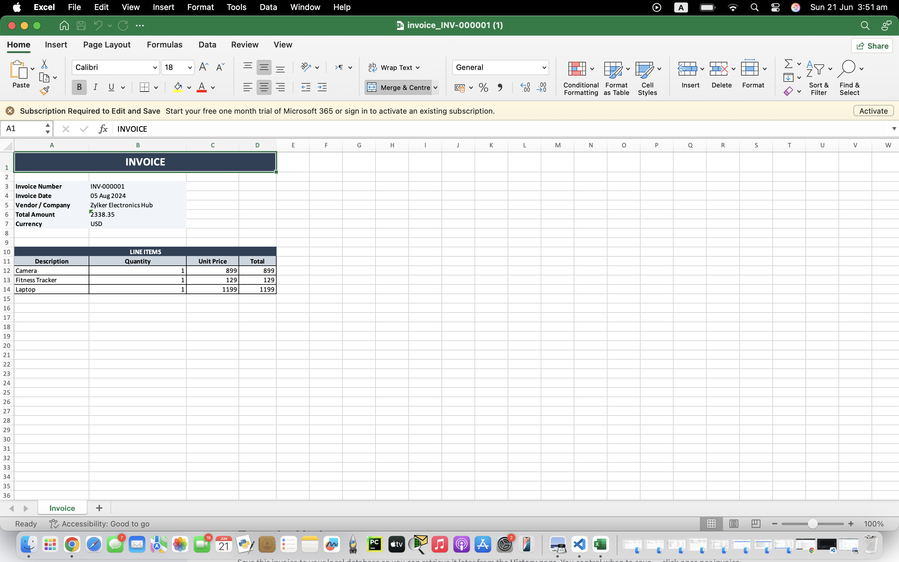

# InvoiceIQ — Invoice-to-Excel Extractor

> A Python + Streamlit portfolio project that converts messy invoice PDFs and images into structured, Excel-ready financial data — with OCR, rule-based parsing, validation, history, and an analytics dashboard.

Built milestone-by-milestone: OCR + regex parsing → validation → SQLite history → analytics → polish.

---

## Screenshots

| Upload & Extraction | Validation |
|:---:|:---:|
|  |  |

| History Page | Analytics Dashboard |
|:---:|:---:|
|  |  |

**Excel Output**



---

## Why I Built This

Businesses receive invoices in all shapes and formats — digital PDFs, scanned images, inconsistent layouts. Manually copying figures into spreadsheets is slow, error-prone, and hard to audit at scale.

InvoiceIQ automates that pipeline: it reads the raw file, extracts every relevant field and line item, validates the maths, and delivers a clean Excel file in seconds. The project goes beyond a simple OCR demo by covering the full document-processing lifecycle:

- **Extraction** — dual strategy (native PDF text first, OCR fallback) for reliability across file types
- **Parsing** — rule-based field and line-item extraction handling two common invoice table layouts
- **Validation** — non-blocking checks for missing fields, tax calculations, and line-item sums
- **History** — SQLite persistence so past invoices can be retrieved, reviewed, and re-exported at any time
- **Analytics** — KPI cards and Plotly charts that surface spending trends across all saved invoices

The result is a portfolio-ready, end-to-end document intelligence project built entirely with open-source Python tools.

---

## Key Features

- **Upload PDF or image** — digital PDF (native text extraction) or scanned PDF/image (OCR via pytesseract)
- **Auto-extract fields** — Invoice Number, Date, Vendor, Subtotal, Tax, Total, Currency, and Line Items
- **Editable form** — fix any misread field before exporting; line items are editable in an interactive table
- **Non-blocking validation** — warns about missing fields, math mismatches, and suspicious totals without blocking export
- **One-click Excel export** — styled `.xlsx` with a header block and a formatted line items table
- **SQLite history** — save, search, re-open, and delete past invoices; local-only, no cloud required
- **Analytics dashboard** — KPI cards, monthly spending trend, top vendors, currency breakdown, and top line items

---

## System Workflow

```
PDF / Image Upload
      │
      ▼
Text Extraction
  ├── PyMuPDF  ──────── digital PDF  (native text, fast and accurate)
  └── pytesseract OCR ─ scanned PDF or image  (Tesseract 5)
      │
      ▼
Rule-based Invoice Parser
  ├── Header fields  →  Invoice Number, Date, Vendor, Currency
  ├── Financials     →  Subtotal, Tax (rate or amount), Total
  └── Line items     →  two layout patterns (Zylker-style and QTY-first)
      │
      ▼
Manual Review & Correction
  └── Editable form + interactive line items table
      │
      ▼
Validation Layer
  ├── Required field presence
  ├── Subtotal + Tax ≈ Total
  └── Sum of line item totals ≈ Invoice total
      │
      ▼
Excel Export
  └── Styled .xlsx — header block + formatted line items table
      │
      ▼
SQLite History
  └── Save · Search · Re-open · Delete  (with ON DELETE CASCADE)
      │
      ▼
Analytics Dashboard
  └── KPI cards · Monthly spend · Top vendors · Currency split · Top line items
```

---

## Using the App

1. **Upload** — drag a PDF or image onto the file uploader on the main page
2. **Extract** — the app auto-extracts all fields and line items (digital PDFs use native text; scanned files use OCR)
3. **Review** — check the extracted fields in the editable form; correct anything that was misread
4. **Validate** — the Validation panel highlights any issues (e.g. "Subtotal + Tax ≠ Total")
5. **Export** — click **Generate Excel File** and download the styled `.xlsx`
6. **Save** — click **Save to History** to store the invoice in the local SQLite database
7. **Analyse** — open the **Analytics** page to see KPI cards and spending charts across all saved invoices

---

## Tech Stack

| Layer | Library / Tool | Purpose |
|-------|---------------|---------|
| UI | Streamlit (multipage) | Pages, form widgets, interactive tables |
| PDF extraction | PyMuPDF (`fitz`) | Native text from digital PDFs |
| OCR | pytesseract + Pillow | Text from scanned PDFs and images |
| Parsing | Python `re` (regex) | Field and line-item extraction |
| Data | pandas | DataFrames, aggregations |
| Excel export | openpyxl | Styled `.xlsx` generation |
| Database | SQLite (stdlib `sqlite3`) | Local invoice history with foreign-key cascades |
| Charts | Plotly Express | Interactive spending charts |

---

## Project Structure

```
InvoiceIQ/
├── app.py               # Main Streamlit page (upload → extract → correct → export → save)
├── requirements.txt     # Runtime dependencies
├── requirements-dev.txt # Dev/test dependencies (pytest)
├── packages.txt         # APT packages for Streamlit Cloud (tesseract-ocr)
├── LICENSE              # MIT License
├── .gitignore
│
├── core/
│   ├── extractor.py     # PDF/image → raw text (PyMuPDF + pytesseract fallback)
│   ├── parser.py        # Raw text → structured fields and line items (regex)
│   ├── validator.py     # Fields + line items → list of validation warnings
│   ├── exporter.py      # Fields + line items → styled Excel file
│   └── database.py      # SQLite helpers (save, load, search, delete)
│
├── pages/
│   ├── history.py       # History page — browse, search, re-open, delete saved invoices
│   └── analytics.py     # Analytics page — KPI cards and spending charts
│
├── tests/
│   └── test_parser.py   # 49 pytest tests covering parser and validator
│
├── screenshots/         # App screenshots displayed in this README
│
├── sample_invoices/     # Synthetic sample invoices for testing (no real data committed)
│
└── data/
    ├── uploads/         # Temporary upload folder (gitignored)
    └── invoices.db      # Local SQLite database (gitignored)
```

---

## Setup

### 1 — Install the Tesseract OCR binary

> **Important:** `pytesseract` is only a Python wrapper. You must install the Tesseract binary at the OS level first — `pip install pytesseract` alone is not enough.

| OS | Command |
|----|---------|
| macOS | `brew install tesseract` |
| Ubuntu / Debian | `sudo apt install tesseract-ocr` |
| Windows | Download the installer from [UB-Mannheim](https://github.com/UB-Mannheim/tesseract/wiki), run it, then add the install folder (e.g. `C:\Program Files\Tesseract-OCR`) to your `PATH` |

Verify: run `tesseract --version` — you should see `tesseract 5.x.x`.

### 2 — Create a virtual environment and install Python dependencies

```bash
python -m venv .venv
source .venv/bin/activate      # Windows: .venv\Scripts\activate
pip install -r requirements.txt
```

### 3 — Run the app

```bash
streamlit run app.py
```

The app opens at `http://localhost:8501`. The SQLite database and uploads folder are created automatically on first run.

### 4 — Run the tests

```bash
pip install -r requirements-dev.txt   # installs pytest (one-time)
pytest tests/ -v
```

49 tests cover invoice field extraction (number, date, vendor, total, subtotal, tax, currency) and line-item parsing across two invoice layouts (Zylker-style and QTY-first).

---

## Sample Invoices

The `sample_invoices/` folder is reserved for synthetic test invoices. Adding sample files here lets anyone clone the repo and immediately test the full pipeline — OCR, parsing, validation, history, and analytics — without needing to source their own invoice PDFs.

**What to add:** Synthetic or anonymised invoices that cover different formats (digital PDF, scanned image, varying line-item layouts).

**What NOT to add:** Real invoices containing private or confidential data. Never commit files with actual vendor names, amounts, or personal information.

If you have synthetic samples, drop them in `sample_invoices/` and add a short description here.

---

## Deploying to Streamlit Cloud

The app can be deployed to [Streamlit Community Cloud](https://streamlit.io/cloud) with one important caveat.

**Tesseract must be installed on the server.** The `packages.txt` file at the repo root already contains:

```
tesseract-ocr
```

Streamlit Cloud reads `packages.txt` and installs APT packages before starting the app. Without this file, OCR will fail with `TesseractNotFoundError` for scanned PDFs and images. Digital PDFs (native text via PyMuPDF) continue to work regardless.

**Database persistence:** `data/invoices.db` is gitignored and created fresh on each deploy. The SQLite file is **ephemeral** on Streamlit Cloud — it resets whenever the app restarts. For persistent history in a deployed app, swap SQLite for a hosted database (e.g. Supabase, PlanetScale).

---

## Current Limitations

**OCR engine (Tesseract)**

The app uses Tesseract through pytesseract for OCR. Tesseract is free, open-source, and lightweight — suitable for local testing and common invoice formats. However, it is not always the best choice for production-level invoice processing. Tesseract can struggle with:

- Complex or irregular table layouts
- Low-resolution or heavily compressed scans
- Unusual or decorative fonts
- Rotated, skewed, or tilted documents
- Handwritten annotations or mixed handwriting/print
- Multi-column layouts where text columns bleed into each other

For production use, a document-intelligence service (see [Future Improvements](#future-improvements)) would provide significantly higher accuracy.

**Parser**

- Rule-based parsing works best on common invoice formats with standard English field labels; unusual layouts or non-standard label names may require manual correction in the app
- OCR quality has a direct impact on parser accuracy — a garbled OCR output will produce incorrect extracted values regardless of parser quality

**Data and storage**

- Multi-currency invoices are stored and displayed by currency code; no live exchange-rate conversion is applied, so cross-currency totals on the analytics dashboard are nominal sums
- SQLite is a single-file local database and is not intended as a production multi-user store; the file resets on each Streamlit Cloud restart

**Language**

- Field label matching is English-only; invoices in other languages are not currently supported

---

## Future Improvements

**Better OCR and document intelligence**

The most impactful upgrade would be replacing or supplementing Tesseract with a table-aware document AI model. Any of these options would improve accuracy on complex tables, low-quality scans, and non-standard layouts significantly over Tesseract alone:

| Option | Notes |
|--------|-------|
| **PaddleOCR** | Open-source, table-aware, strong on non-English and complex layouts |
| **Google Document AI — Invoice Parser** | Cloud API, pre-trained specifically on invoices |
| **Amazon Textract** | AWS cloud API with table and key-value form extraction |
| **Azure AI Document Intelligence** | Microsoft cloud API, invoice-specific pre-built model |
| **LLM-assisted fallback (Claude / GPT)** | Use a language model to parse invoices the regex engine cannot handle |

**App features**

- **Duplicate invoice detection** — warn before saving when an invoice number already exists in history
- **Bulk upload** — process a folder of invoices at once and export a combined summary spreadsheet
- **Dashboard filters** — filter analytics charts by date range, vendor, or currency
- **Multi-language support** — detect and match field labels in French, Arabic, German, and other languages
- **Hosted database** — replace SQLite with Supabase or PostgreSQL for persistent, multi-user history
- **Email integration** — pull invoice attachments directly from Gmail or Outlook via API
- **CSV export** — add a second download option alongside Excel

---

## Repository Polish Checklist

- ✅ Screenshots added and displayed in README
- ✅ 49 automated tests included (`pytest tests/ -v`)
- ✅ Streamlit Cloud deployment dependency documented (`packages.txt` with `tesseract-ocr`)
- ✅ MIT License added (`LICENSE`)
- ✅ Future OCR and document-intelligence improvements documented

---

## Troubleshooting

### `TesseractNotFoundError` when uploading a scanned PDF or image

1. **Is Tesseract installed?** Run `tesseract --version`. If not found, follow Setup step 1 above.
2. **macOS / Linux** — run `which tesseract` to confirm the binary is on your PATH.
3. **Windows** — after installing, add the Tesseract folder to your `PATH` environment variable and restart your terminal (or VS Code).
4. If Tesseract is installed in a non-standard location, add this line at the top of `core/extractor.py`:
   ```python
   pytesseract.pytesseract.tesseract_cmd = r"C:\Program Files\Tesseract-OCR\tesseract.exe"
   ```

### OCR extracts garbled text

Upload a higher-resolution scan (300 DPI or above). The extractor renders scanned PDFs at 2× zoom automatically; for images, make sure they are not blurry or heavily compressed.

### Parser extracts wrong values

The regex parser works well for standard layouts. Use the manual correction form to fix any misread field before exporting — no re-upload is needed.

---

## Roadmap

| Milestone | Goal | Status |
|-----------|------|--------|
| 1 | Upload → OCR/parse → manual correct → export Excel | ✅ Done |
| 2 | Validation layer — missing fields, math checks, warnings | ✅ Done |
| 3 | SQLite history — save, browse, re-open, delete | ✅ Done |
| 4 | Analytics dashboard — KPI cards, spending trends, vendor summaries | ✅ Done |
| 5 | Polish, screenshots, deployment preparation | ✅ Done |
| 6 | Optional — better OCR / LLM-assisted parsing for higher accuracy | Future |
